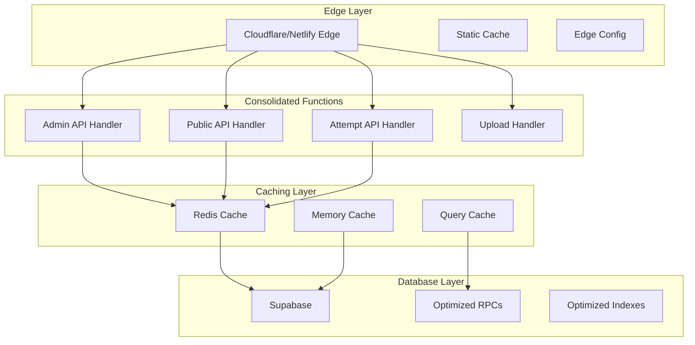

# Design Document

## Overview

The Advanced Exam Application currently deploys 63+ API routes as individual Netlify Functions, exceeding the platform's limits and causing deployment failures. This design outlines a comprehensive optimization strategy that consolidates functions, implements intelligent caching, leverages edge computing, and optimizes database interactions while maintaining 100% feature parity.

The solution employs a multi-layered approach:
1. **Function Consolidation**: Merge related API routes into unified handlers
2. **Edge Computing**: Move static and cacheable operations to edge functions
3. **Intelligent Caching**: Implement multi-tier caching strategies
4. **Database Optimization**: Streamline queries and leverage Supabase RPC functions
5. **Static Generation**: Pre-generate content where possible

## Architecture

### Current Architecture Issues

The existing architecture creates one Netlify Function per API route, resulting in:
- 63+ individual serverless functions
- Redundant authentication and initialization code
- Inefficient resource utilization
- High cold start overhead
- Complex deployment and monitoring

### Proposed Architecture



### Function Consolidation Strategy

#### 1. Admin API Consolidation
**Target**: Reduce 25+ admin routes to 1 unified handler
- Consolidate all `/api/admin/*` routes into a single function
- Use path-based routing within the handler
- Maintain authentication middleware
- Preserve all existing functionality

#### 2. Public API Consolidation  
**Target**: Reduce 8+ public routes to 1 unified handler
- Merge all `/api/public/*` routes
- Implement internal routing logic
- Maintain caching strategies
- Preserve security measures

#### 3. Attempt Management Consolidation
**Target**: Reduce 6+ attempt routes to 1 unified handler
- Consolidate `/api/attempts/[attemptId]/*` routes
- Implement action-based routing
- Maintain real-time capabilities
- Preserve data consistency

#### 4. Specialized Handlers
- **Upload Handler**: Dedicated function for file uploads
- **Auth Handler**: Consolidated authentication endpoints
- **Webhook Handler**: External integrations (WhatsApp, etc.)

## Components and Interfaces

### 1. Unified API Handler Interface

```typescript
interface UnifiedAPIHandler {
  route: string;
  method: HTTPMethod;
  handler: (request: APIRequest) => Promise<APIResponse>;
  middleware: Middleware[];
  caching: CacheConfig;
}

interface APIRequest {
  path: string[];
  method: string;
  body: any;
  query: Record<string, string>;
  headers: Record<string, string>;
  user?: AuthenticatedUser;
}
```

### 2. Caching Interface

```typescript
interface CacheConfig {
  strategy: 'none' | 'memory' | 'edge' | 'database';
  ttl: number;
  tags: string[];
  invalidation: InvalidationRule[];
}

interface CacheManager {
  get<T>(key: string): Promise<T | null>;
  set<T>(key: string, value: T, ttl?: number): Promise<void>;
  invalidate(tags: string[]): Promise<void>;
  clear(): Promise<void>;
}
```

### 3. Database Optimization Interface

```typescript
interface OptimizedQuery {
  name: string;
  query: string;
  parameters: QueryParameter[];
  caching: CacheConfig;
  indexes: string[];
}

interface QueryOptimizer {
  optimize(query: string): OptimizedQuery;
  batch(queries: OptimizedQuery[]): Promise<any[]>;
  cache(key: string, query: OptimizedQuery): Promise<any>;
}
```

## Data Models

### 1. Function Registry

```typescript
interface FunctionRegistry {
  id: string;
  name: string;
  routes: string[];
  handler: string;
  status: 'active' | 'deprecated' | 'migrated';
  metrics: FunctionMetrics;
  created_at: Date;
  updated_at: Date;
}

interface FunctionMetrics {
  invocations: number;
  avg_duration: number;
  error_rate: number;
  memory_usage: number;
  last_invocation: Date;
}
```

### 2. Cache Entries

```typescript
interface CacheEntry {
  key: string;
  value: any;
  ttl: number;
  tags: string[];
  created_at: Date;
  accessed_at: Date;
  hit_count: number;
}
```

### 3. Performance Metrics

```typescript
interface PerformanceMetrics {
  function_count: number;
  total_invocations: number;
  avg_response_time: number;
  cache_hit_rate: number;
  error_rate: number;
  cost_reduction: number;
  timestamp: Date;
}
```

## Error Handling

### 1. Graceful Degradation Strategy

```typescript
interface ErrorHandler {
  handle(error: Error, context: RequestContext): APIResponse;
  fallback(request: APIRequest): Promise<APIResponse>;
  retry(request: APIRequest, attempts: number): Promise<APIResponse>;
}
```

### 2. Circuit Breaker Pattern

```typescript
interface CircuitBreaker {
  state: 'closed' | 'open' | 'half-open';
  failure_threshold: number;
  recovery_timeout: number;
  execute<T>(operation: () => Promise<T>): Promise<T>;
}
```

### 3. Error Recovery Mechanisms

- **Automatic Retry**: Implement exponential backoff for transient failures
- **Fallback Responses**: Serve cached or default responses when primary fails
- **Health Checks**: Monitor function health and automatically route around failures
- **Rollback Capability**: Instant rollback to previous stable version

## Testing Strategy

### 1. Function Consolidation Testing

```typescript
interface ConsolidationTest {
  original_routes: string[];
  consolidated_handler: string;
  test_cases: TestCase[];
  performance_benchmarks: Benchmark[];
}

interface TestCase {
  route: string;
  method: string;
  input: any;
  expected_output: any;
  expected_status: number;
}
```

### 2. Performance Testing

- **Load Testing**: Simulate high-traffic scenarios
- **Stress Testing**: Test function limits and recovery
- **Endurance Testing**: Long-running performance validation
- **Spike Testing**: Handle sudden traffic increases

### 3. Cache Testing

- **Cache Hit/Miss Ratios**: Validate caching effectiveness
- **Invalidation Testing**: Ensure proper cache invalidation
- **Consistency Testing**: Verify data consistency across cache layers
- **Performance Impact**: Measure cache performance improvements

### 4. Migration Testing

- **Blue-Green Deployment**: Test new functions alongside old ones
- **Canary Releases**: Gradual rollout with monitoring
- **Rollback Testing**: Validate rollback procedures
- **Data Integrity**: Ensure no data loss during migration

## Implementation Phases

### Phase 1: Analysis and Preparation (Week 1)
1. **Function Audit**: Complete analysis of all 63+ functions
2. **Performance Baseline**: Establish current performance metrics
3. **Dependency Mapping**: Identify function interdependencies
4. **Risk Assessment**: Evaluate migration risks and mitigation strategies

### Phase 2: Core Consolidation (Week 2-3)
1. **Admin API Consolidation**: Merge admin routes into unified handler
2. **Public API Consolidation**: Consolidate public endpoints
3. **Authentication Optimization**: Streamline auth flows
4. **Testing**: Comprehensive testing of consolidated functions

### Phase 3: Advanced Optimizations (Week 4)
1. **Caching Implementation**: Deploy multi-tier caching
2. **Edge Computing**: Move appropriate logic to edge functions
3. **Database Optimization**: Implement query optimizations
4. **Static Generation**: Pre-generate static content

### Phase 4: Monitoring and Validation (Week 5)
1. **Performance Monitoring**: Deploy monitoring systems
2. **Load Testing**: Validate performance under load
3. **Security Audit**: Ensure security measures are maintained
4. **Documentation**: Complete technical documentation

## Monitoring and Alerting

### 1. Function Health Monitoring

```typescript
interface FunctionHealth {
  function_name: string;
  status: 'healthy' | 'degraded' | 'unhealthy';
  response_time: number;
  error_rate: number;
  memory_usage: number;
  cpu_usage: number;
  last_check: Date;
}
```

### 2. Performance Dashboards

- **Real-time Metrics**: Function invocations, response times, error rates
- **Cost Tracking**: Monitor function costs and savings
- **Cache Performance**: Hit rates, invalidation patterns
- **User Experience**: End-to-end response times

### 3. Alerting Rules

- **Function Limit Approaching**: Alert at 80% of function limit
- **Performance Degradation**: Alert on response time increases
- **Error Rate Spikes**: Alert on error rate above threshold
- **Cache Miss Rates**: Alert on cache performance issues

## Security Considerations

### 1. Authentication Consolidation

- **Centralized Auth**: Single authentication middleware for all functions
- **Token Validation**: Efficient JWT validation and caching
- **Permission Caching**: Cache user permissions to reduce database calls
- **Security Headers**: Consistent security headers across all endpoints

### 2. Rate Limiting

```typescript
interface RateLimiter {
  limit: number;
  window: number;
  key_generator: (request: APIRequest) => string;
  storage: 'memory' | 'redis' | 'database';
}
```

### 3. Input Validation

- **Schema Validation**: Centralized input validation using Zod
- **Sanitization**: Consistent input sanitization across all endpoints
- **CORS Handling**: Unified CORS configuration
- **CSRF Protection**: Maintain CSRF protection in consolidated handlers

## Rollback Strategy

### 1. Blue-Green Deployment

```typescript
interface DeploymentStrategy {
  type: 'blue-green' | 'canary' | 'rolling';
  health_checks: HealthCheck[];
  rollback_triggers: RollbackTrigger[];
  rollback_timeout: number;
}
```

### 2. Automatic Rollback Triggers

- **Error Rate Threshold**: Rollback if error rate exceeds 5%
- **Response Time Degradation**: Rollback if response time increases by 50%
- **Function Failures**: Rollback if any critical function fails
- **Health Check Failures**: Rollback on health check failures

### 3. Manual Rollback Procedures

- **One-Click Rollback**: Simple rollback mechanism in deployment pipeline
- **Partial Rollback**: Ability to rollback specific function groups
- **Data Consistency**: Ensure data consistency during rollback
- **Communication Plan**: Notify stakeholders of rollback events

## Success Metrics

### 1. Function Optimization Metrics

- **Function Count Reduction**: Target 40%+ reduction (from 63+ to <38)
- **Response Time Improvement**: Target 25%+ improvement
- **Error Rate Maintenance**: Keep error rate below current levels
- **Cost Reduction**: Achieve measurable cost savings

### 2. Performance Metrics

- **Cache Hit Rate**: Target 80%+ cache hit rate
- **Database Query Reduction**: Target 30%+ reduction in database calls
- **Memory Usage Optimization**: Reduce average memory usage per function
- **Cold Start Reduction**: Minimize cold start impact

### 3. Operational Metrics

- **Deployment Success Rate**: Maintain 100% successful deployments
- **Rollback Time**: Achieve <5 minute rollback capability
- **Monitoring Coverage**: 100% monitoring coverage of critical functions
- **Documentation Completeness**: Complete documentation for all changes