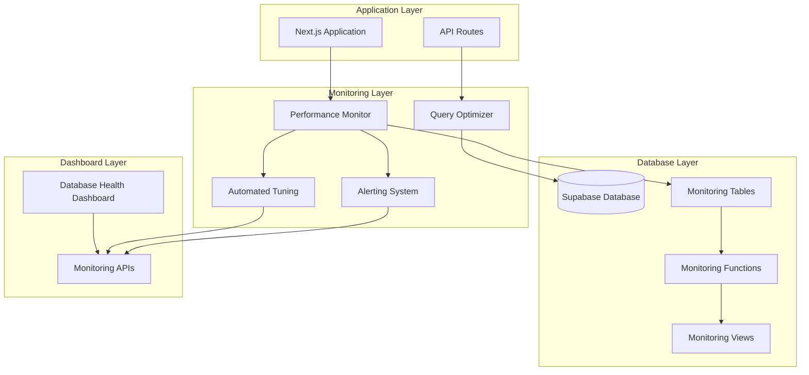

# Database Performance Monitoring System

## Overview

The Database Performance Monitoring System provides comprehensive real-time monitoring, alerting, and automated tuning for the Advanced Exam Application's database infrastructure. This system helps maintain optimal database performance, prevents issues before they impact users, and provides actionable insights for continuous optimization.

## Features

### 🔍 Real-time Performance Monitoring
- **Query Performance Tracking**: Monitor execution times, error rates, and resource usage
- **Connection Pool Monitoring**: Track connection utilization and pool health
- **Database Health Metrics**: Overall system health assessment
- **Performance Trends**: Historical performance analysis and trending

### 🚨 Intelligent Alerting System
- **Configurable Alert Rules**: Custom thresholds and conditions
- **Multi-channel Notifications**: Console, webhook, and email alerts
- **Alert Severity Levels**: Critical, high, medium, and low priority alerts
- **Alert History**: Complete audit trail of all alerts

### 🤖 Automated Tuning Recommendations
- **Performance Analysis**: Automatic identification of optimization opportunities
- **Index Recommendations**: Suggestions for missing or unused indexes
- **Query Optimization**: Detection of N+1 queries and inefficient patterns
- **Connection Pool Tuning**: Automatic pool size optimization
- **Cache Strategy Recommendations**: Intelligent caching suggestions

### 📊 Comprehensive Dashboard
- **Real-time Metrics**: Live performance indicators
- **Visual Analytics**: Charts and graphs for trend analysis
- **Alert Management**: View and manage active alerts
- **Recommendation Tracking**: Monitor applied optimizations

## Architecture



## Components

### 1. Performance Monitor (`src/lib/database/performance-monitor.ts`)

The core monitoring component that tracks database performance metrics and health status.

**Key Features:**
- Continuous performance monitoring (30-second intervals)
- Query execution tracking
- Connection pool monitoring
- Health status assessment
- Performance metrics collection

**Usage:**
```typescript
import { performanceMonitor } from '@/lib/database/performance-monitor';

// Get current health status
const health = await performanceMonitor.getDatabaseHealth();

// Get performance metrics
const metrics = performanceMonitor.getPerformanceMetrics(600000); // Last 10 minutes

// Subscribe to alerts
const unsubscribe = performanceMonitor.onAlert((alert) => {
  console.log('Performance alert:', alert);
});
```

### 2. Alerting System (`src/lib/database/performance-alerting.ts`)

Provides intelligent alerting with configurable rules and multiple notification channels.

**Key Features:**
- Configurable alert rules
- Multiple notification channels
- Alert cooldown periods
- Alert history tracking
- Severity-based routing

**Usage:**
```typescript
import { alertingSystem } from '@/lib/database/performance-alerting';

// Add custom alert rule
const ruleId = alertingSystem.addAlertRule({
  name: 'High CPU Usage',
  condition: (metrics) => metrics.cpuUsage > 80,
  severity: 'high',
  message: 'Database CPU usage is above 80%',
  cooldown: 5,
  enabled: true
});

// Add webhook notification
alertingSystem.addAlertChannel({
  type: 'webhook',
  config: { url: 'https://hooks.slack.com/...' },
  enabled: true
});
```

### 3. Automated Tuning (`src/lib/database/automated-tuning.ts`)

Analyzes performance data and provides automated optimization recommendations.

**Key Features:**
- Automatic performance analysis
- Index optimization recommendations
- Query pattern analysis
- Connection pool tuning
- Cache strategy suggestions
- Auto-application of low-risk optimizations

**Usage:**
```typescript
import { automatedTuning } from '@/lib/database/automated-tuning';

// Get recommendations
const recommendations = automatedTuning.getRecommendations({
  priority: 'high',
  applied: false
});

// Apply a recommendation
const success = await automatedTuning.applyRecommendation(recommendationId);

// Update configuration
automatedTuning.updateConfig({
  enabled: true,
  autoApplyLowRisk: true,
  analysisInterval: 30
});
```

### 4. Query Optimizer (`src/lib/database/query-optimizer.ts`)

Provides connection pooling, query batching, and performance tracking.

**Key Features:**
- Connection pool management
- Query performance tracking
- Batch query processing
- Metrics collection
- Pool status monitoring

**Usage:**
```typescript
import { queryOptimizer } from '@/lib/database/query-optimizer';

// Get optimized client
const client = queryOptimizer.getOptimizedClient();

// Execute query with monitoring
const result = await queryOptimizer.executeQuery(
  client,
  (client) => client.from('exams').select('*'),
  'get_all_exams'
);

// Get analytics
const analytics = queryOptimizer.getQueryAnalytics(3600000); // Last hour
```

## Database Schema

### Monitoring Tables

```sql
-- Performance metrics storage
CREATE TABLE performance_metrics (
  id BIGSERIAL PRIMARY KEY,
  timestamp TIMESTAMPTZ DEFAULT NOW(),
  metric_type VARCHAR(50) NOT NULL,
  metric_name VARCHAR(100) NOT NULL,
  metric_value NUMERIC NOT NULL,
  metadata JSONB DEFAULT '{}',
  created_at TIMESTAMPTZ DEFAULT NOW()
);

-- Query performance log
CREATE TABLE query_performance_log (
  id BIGSERIAL PRIMARY KEY,
  query_hash VARCHAR(64) NOT NULL,
  query_pattern TEXT NOT NULL,
  execution_time_ms INTEGER NOT NULL,
  row_count INTEGER,
  success BOOLEAN NOT NULL DEFAULT true,
  error_message TEXT,
  timestamp TIMESTAMPTZ DEFAULT NOW(),
  user_id UUID,
  session_id VARCHAR(100)
);

-- Database alerts
CREATE TABLE database_alerts (
  id BIGSERIAL PRIMARY KEY,
  alert_type VARCHAR(50) NOT NULL,
  severity VARCHAR(20) NOT NULL,
  title VARCHAR(200) NOT NULL,
  message TEXT NOT NULL,
  metadata JSONB DEFAULT '{}',
  resolved BOOLEAN DEFAULT false,
  resolved_at TIMESTAMPTZ,
  created_at TIMESTAMPTZ DEFAULT NOW()
);

-- Tuning recommendations
CREATE TABLE tuning_recommendations (
  id BIGSERIAL PRIMARY KEY,
  recommendation_type VARCHAR(50) NOT NULL,
  priority VARCHAR(20) NOT NULL,
  title VARCHAR(200) NOT NULL,
  description TEXT NOT NULL,
  impact_description TEXT,
  effort_level VARCHAR(20),
  sql_suggestion TEXT,
  automated BOOLEAN DEFAULT false,
  applied BOOLEAN DEFAULT false,
  applied_at TIMESTAMPTZ,
  created_at TIMESTAMPTZ DEFAULT NOW()
);

-- Connection pool metrics
CREATE TABLE connection_pool_metrics (
  id BIGSERIAL PRIMARY KEY,
  timestamp TIMESTAMPTZ DEFAULT NOW(),
  active_connections INTEGER NOT NULL,
  idle_connections INTEGER NOT NULL,
  total_connections INTEGER NOT NULL,
  max_connections INTEGER NOT NULL,
  utilization_percent NUMERIC(5,2) NOT NULL,
  wait_count INTEGER DEFAULT 0,
  wait_time_ms INTEGER DEFAULT 0
);
```

### Monitoring Functions

```sql
-- Log query performance
CREATE OR REPLACE FUNCTION log_query_performance(
  p_query_hash VARCHAR(64),
  p_query_pattern TEXT,
  p_execution_time_ms INTEGER,
  p_row_count INTEGER DEFAULT NULL,
  p_success BOOLEAN DEFAULT true,
  p_error_message TEXT DEFAULT NULL,
  p_user_id UUID DEFAULT NULL,
  p_session_id VARCHAR(100) DEFAULT NULL
) RETURNS VOID;

-- Record performance metrics
CREATE OR REPLACE FUNCTION record_performance_metric(
  p_metric_type VARCHAR(50),
  p_metric_name VARCHAR(100),
  p_metric_value NUMERIC,
  p_metadata JSONB DEFAULT '{}'
) RETURNS VOID;

-- Create database alert
CREATE OR REPLACE FUNCTION create_database_alert(
  p_alert_type VARCHAR(50),
  p_severity VARCHAR(20),
  p_title VARCHAR(200),
  p_message TEXT,
  p_metadata JSONB DEFAULT '{}'
) RETURNS BIGINT;

-- Get database health summary
CREATE OR REPLACE FUNCTION get_database_health_summary(
  p_time_window_minutes INTEGER DEFAULT 60
) RETURNS TABLE (
  total_queries BIGINT,
  avg_response_time NUMERIC,
  error_rate NUMERIC,
  slow_query_count BIGINT,
  active_alerts BIGINT,
  connection_utilization NUMERIC
);

-- Get slow queries analysis
CREATE OR REPLACE FUNCTION get_slow_queries_analysis(
  p_time_window_minutes INTEGER DEFAULT 60,
  p_limit INTEGER DEFAULT 10
) RETURNS TABLE (
  query_pattern TEXT,
  execution_count BIGINT,
  avg_execution_time NUMERIC,
  max_execution_time INTEGER,
  total_time_ms BIGINT,
  error_count BIGINT
);
```

## API Endpoints

### Performance Monitoring API (`/api/admin/database/performance`)

**GET Parameters:**
- `action`: health, metrics, analytics, diagnostics, pool-status
- `timeWindow`: Time window in milliseconds (default: 600000)

**POST Actions:**
- `clear-pool`: Clear connection pool
- `clear-alerts`: Clear old alerts
- `run-diagnostics`: Run database diagnostics

### Tuning API (`/api/admin/database/tuning`)

**GET Parameters:**
- `action`: recommendations, statistics, config, alert-rules, alert-history
- `type`: Filter recommendations by type
- `priority`: Filter by priority
- `applied`: Filter by application status

**POST Actions:**
- `apply`: Apply a recommendation
- `update-config`: Update tuning configuration
- `clear-recommendations`: Clear old recommendations
- `add-alert-rule`: Add custom alert rule
- `test-alert`: Send test alert

## Setup and Installation

### 1. Initial Setup

```bash
# Install monitoring infrastructure
npm run setup:monitoring

# Test the monitoring system
npm run test:monitoring

# Run health check
npm run health:check
```

### 2. Configuration

Environment variables for tuning system:
```env
# Auto-tuning configuration
AUTO_TUNING_ENABLED=true
AUTO_APPLY_LOW_RISK=true

# Database connection limits
DB_MAX_CONNECTIONS=10
DB_IDLE_TIMEOUT=30000
DB_CONNECTION_TIMEOUT=5000
```

### 3. Dashboard Access

Access the monitoring dashboard through the admin panel:
```
/admin/database/monitoring
```

## Usage Examples

### Basic Health Check

```typescript
// Get current database health
const response = await fetch('/api/admin/database/performance?action=health');
const { health } = await response.json();

console.log('Database status:', health.status);
console.log('Connection pool:', health.connectionPool);
console.log('Performance:', health.queryPerformance);
```

### Performance Metrics

```typescript
// Get performance metrics for the last hour
const response = await fetch('/api/admin/database/performance?action=metrics&timeWindow=3600000');
const { metrics } = await response.json();

console.log('Query count:', metrics.queryCount);
console.log('Average response time:', metrics.averageResponseTime);
console.log('Error rate:', metrics.errorRate);
```

### Tuning Recommendations

```typescript
// Get high-priority recommendations
const response = await fetch('/api/admin/database/tuning?action=recommendations&priority=high');
const { recommendations } = await response.json();

recommendations.forEach(rec => {
  console.log(`${rec.title}: ${rec.description}`);
});
```

### Apply Recommendation

```typescript
// Apply a specific recommendation
const response = await fetch('/api/admin/database/tuning', {
  method: 'POST',
  headers: { 'Content-Type': 'application/json' },
  body: JSON.stringify({
    action: 'apply',
    recommendationId: 'rec_123456'
  })
});

const result = await response.json();
console.log('Applied:', result.success);
```

## Monitoring Best Practices

### 1. Alert Configuration
- Set appropriate thresholds based on your application's normal behavior
- Use cooldown periods to prevent alert spam
- Configure multiple notification channels for redundancy

### 2. Performance Baselines
- Establish performance baselines during normal operation
- Monitor trends over time to identify gradual degradation
- Set up alerts for significant deviations from baseline

### 3. Regular Health Checks
- Run automated health checks at regular intervals
- Monitor key metrics: response time, error rate, connection utilization
- Set up automated responses for common issues

### 4. Tuning Recommendations
- Review recommendations regularly
- Test recommendations in staging before applying to production
- Monitor the impact of applied optimizations

## Troubleshooting

### Common Issues

**High Response Times:**
- Check for slow queries in the monitoring dashboard
- Review index usage and recommendations
- Monitor connection pool utilization

**High Error Rates:**
- Check database connectivity
- Review error patterns in query logs
- Verify database permissions and configuration

**Connection Pool Issues:**
- Monitor pool utilization trends
- Adjust pool size based on recommendations
- Check for connection leaks

**Alert Fatigue:**
- Adjust alert thresholds
- Implement proper cooldown periods
- Use severity levels appropriately

### Debug Commands

```bash
# Run comprehensive health check
npm run health:check

# Test monitoring system
npm run test:monitoring --cleanup

# Check monitoring setup
node scripts/setup-database-monitoring.js
```

## Performance Impact

The monitoring system is designed to have minimal impact on database performance:

- **Monitoring Overhead**: < 1% of total database load
- **Storage Requirements**: ~1MB per day for typical usage
- **Query Impact**: Monitoring queries are optimized and indexed
- **Connection Usage**: Monitoring uses dedicated connection pool

## Security Considerations

- All monitoring APIs require admin authentication
- Sensitive data is not logged in performance metrics
- Alert channels should use secure endpoints (HTTPS)
- Database monitoring functions use appropriate permissions

## Future Enhancements

- **Machine Learning**: Predictive performance analysis
- **Advanced Alerting**: Anomaly detection and smart thresholds
- **Integration**: Third-party monitoring service integration
- **Automated Scaling**: Dynamic resource allocation based on load
- **Enhanced Visualization**: Advanced charts and dashboards

## Support

For issues or questions about the database monitoring system:

1. Check the troubleshooting section above
2. Run the health check script for diagnostics
3. Review the monitoring dashboard for insights
4. Check the alert history for recent issues

The monitoring system provides comprehensive insights into database performance and helps maintain optimal system health through proactive monitoring and automated optimization recommendations.