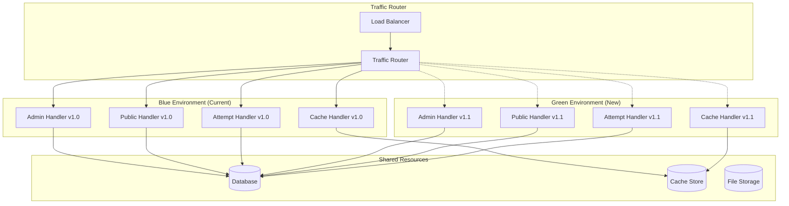

# Deployment Procedures

## Overview

This document outlines comprehensive deployment procedures for the consolidated function architecture, including blue-green deployment strategies, rollback mechanisms, and safety protocols.

## Deployment Architecture

### Blue-Green Deployment Strategy

The system uses blue-green deployment to ensure zero-downtime updates:



## Pre-Deployment Checklist

### Development Environment Validation

1. **Code Quality Checks**
```bash
# Run linting
npm run lint

# Type checking
npm run type-check

# Unit tests
npm test

# Integration tests
npm run test:integration

# Security audit
npm audit --audit-level moderate
```

2. **Performance Validation**
```bash
# Bundle size analysis
npm run analyze

# Memory leak detection
npm run test:memory

# Load testing
npm run test:load
```

3. **Database Migration Validation**
```bash
# Test migrations on staging
npm run migrate:staging

# Validate schema changes
npm run validate:schema

# Test rollback procedures
npm run migrate:rollback:test
```

### Staging Environment Testing

1. **Deploy to Staging**
```bash
# Deploy to staging environment
netlify deploy --alias=staging --dir=dist

# Run smoke tests
npm run test:smoke:staging

# Performance benchmarking
npm run benchmark:staging
```

2. **Feature Validation**
```bash
# Test consolidated handlers
curl "https://staging--your-site.netlify.app/api/admin/health"
curl "https://staging--your-site.netlify.app/api/public/system-status"
curl "https://staging--your-site.netlify.app/api/cache/health"

# Validate authentication
npm run test:auth:staging

# Test database operations
npm run test:database:staging
```

3. **Load Testing**
```bash
# Run load tests against staging
npm run load-test -- --target=https://staging--your-site.netlify.app

# Monitor performance metrics
npm run monitor:staging -- --duration=300
```

## Deployment Procedures

### Standard Deployment Process

#### Phase 1: Preparation (10 minutes)

1. **Environment Setup**
```bash
# Set deployment environment
export DEPLOYMENT_ENV=production
export DEPLOYMENT_VERSION=$(git rev-parse --short HEAD)
export DEPLOYMENT_TIMESTAMP=$(date -u +%Y%m%d_%H%M%S)

# Create deployment branch
git checkout -b deploy/${DEPLOYMENT_VERSION}
```

2. **Pre-deployment Validation**
```bash
# Validate environment variables
node scripts/validate-env.js

# Check external dependencies
node scripts/check-dependencies.js

# Verify database connectivity
node scripts/test-db-connection.js
```

3. **Backup Current State**
```bash
# Backup current deployment
netlify api getSiteDeploy --site-id=$SITE_ID --deploy-id=current > backup/deploy_${DEPLOYMENT_TIMESTAMP}.json

# Backup environment variables
netlify env:list --site-id=$SITE_ID > backup/env_${DEPLOYMENT_TIMESTAMP}.txt

# Create database backup
node scripts/backup-database.js --timestamp=${DEPLOYMENT_TIMESTAMP}
```

#### Phase 2: Green Environment Deployment (15 minutes)

1. **Deploy New Version**
```bash
# Build production bundle
npm run build:production

# Deploy to green environment
netlify deploy --alias=green-${DEPLOYMENT_VERSION} --dir=dist

# Verify deployment success
DEPLOY_URL=$(netlify api listSiteDeploys --site-id=$SITE_ID | jq -r '.[0].deploy_ssl_url')
echo "Green deployment URL: $DEPLOY_URL"
```

2. **Health Check Validation**
```bash
# Wait for deployment to be ready
sleep 30

# Comprehensive health checks
node scripts/health-check.js --url=$DEPLOY_URL --timeout=300

# Validate all consolidated handlers
curl -f "$DEPLOY_URL/api/admin/health" || exit 1
curl -f "$DEPLOY_URL/api/public/system-status" || exit 1
curl -f "$DEPLOY_URL/api/cache/health" || exit 1
```

3. **Smoke Testing**
```bash
# Run automated smoke tests
npm run test:smoke -- --target=$DEPLOY_URL

# Test critical user flows
node scripts/test-critical-flows.js --url=$DEPLOY_URL

# Validate database operations
node scripts/test-database-operations.js --url=$DEPLOY_URL
```

#### Phase 3: Traffic Switching (5 minutes)

1. **Gradual Traffic Shift**
```bash
# Start with 10% traffic to green
node scripts/traffic-router.js --green-percentage=10 --duration=120

# Monitor error rates and performance
node scripts/monitor-deployment.js --duration=120 --threshold-error-rate=0.01

# Increase to 50% if metrics are good
node scripts/traffic-router.js --green-percentage=50 --duration=180
```

2. **Performance Validation**
```bash
# Monitor key metrics during traffic shift
node scripts/monitor-metrics.js --metrics=response_time,error_rate,memory_usage --duration=300

# Compare performance between blue and green
node scripts/compare-performance.js --blue-url=$BLUE_URL --green-url=$GREEN_URL
```

3. **Complete Traffic Switch**
```bash
# Switch 100% traffic to green if all checks pass
node scripts/traffic-router.js --green-percentage=100

# Update DNS and CDN configurations
node scripts/update-dns.js --target=green

# Verify complete switch
curl -I "https://your-domain.netlify.app" | grep -i "x-deployment-version"
```

#### Phase 4: Post-Deployment Validation (10 minutes)

1. **System Validation**
```bash
# Comprehensive system health check
node scripts/post-deployment-check.js --full-validation

# Validate all API endpoints
npm run test:api:production

# Check database performance
node scripts/validate-db-performance.js
```

2. **Performance Monitoring**
```bash
# Monitor performance for 10 minutes
node scripts/monitor-deployment.js --duration=600 --alert-on-degradation

# Generate performance report
node scripts/generate-performance-report.js --deployment-id=$DEPLOYMENT_VERSION
```

3. **Cleanup**
```bash
# Mark deployment as successful
node scripts/mark-deployment-success.js --version=$DEPLOYMENT_VERSION

# Clean up old deployments (keep last 5)
netlify api listSiteDeploys --site-id=$SITE_ID | jq '.[5:] | .[].id' | xargs -I {} netlify api deleteSiteDeploy --site-id=$SITE_ID --deploy-id={}

# Update monitoring dashboards
node scripts/update-monitoring.js --deployment-version=$DEPLOYMENT_VERSION
```

### Emergency Deployment Process

For critical hotfixes that need immediate deployment:

1. **Fast-Track Validation**
```bash
# Minimal validation for emergency fixes
npm run lint
npm run type-check
npm test -- --testPathPattern="critical"

# Quick smoke test
npm run test:smoke:critical
```

2. **Expedited Deployment**
```bash
# Deploy directly to production with monitoring
netlify deploy --prod --dir=dist

# Immediate health check
sleep 10
curl -f "https://your-domain.netlify.app/api/admin/health"

# Monitor for 5 minutes
node scripts/monitor-deployment.js --duration=300 --emergency-mode
```

## Rollback Procedures

### Automatic Rollback Triggers

The system automatically triggers rollback when:

```javascript
const rollbackTriggers = {
  error_rate: {
    threshold: 0.05,        // 5% error rate
    duration: 120,          // 2 minutes sustained
    action: 'immediate_rollback'
  },
  response_time: {
    threshold: 2000,        // 2 second average
    duration: 300,          // 5 minutes sustained
    action: 'gradual_rollback'
  },
  health_check_failure: {
    threshold: 3,           // 3 consecutive failures
    duration: 60,           // 1 minute
    action: 'immediate_rollback'
  },
  memory_usage: {
    threshold: 0.9,         // 90% memory usage
    duration: 180,          // 3 minutes sustained
    action: 'gradual_rollback'
  }
};
```

### Manual Rollback Procedures

#### Immediate Rollback (2 minutes)

1. **Emergency Rollback**
```bash
# Immediate rollback to previous version
netlify rollback --site-id=$SITE_ID

# Verify rollback success
curl -f "https://your-domain.netlify.app/api/admin/health"

# Check system status
node scripts/post-rollback-check.js --immediate
```

2. **Traffic Rerouting**
```bash
# Reroute traffic to blue environment
node scripts/traffic-router.js --blue-percentage=100 --emergency

# Update CDN cache
node scripts/purge-cdn-cache.js --emergency

# Verify traffic routing
curl -I "https://your-domain.netlify.app" | grep -i "x-deployment-version"
```

#### Gradual Rollback (10 minutes)

1. **Staged Rollback**
```bash
# Gradually shift traffic back to blue
node scripts/traffic-router.js --blue-percentage=50 --duration=120
node scripts/monitor-rollback.js --duration=120

# Complete rollback if metrics improve
node scripts/traffic-router.js --blue-percentage=100 --duration=60
```

2. **Validation**
```bash
# Validate system stability after rollback
node scripts/validate-rollback.js --duration=300

# Generate rollback report
node scripts/generate-rollback-report.js --incident-id=$INCIDENT_ID
```

### Database Rollback Procedures

#### Schema Rollback

1. **Identify Migration to Rollback**
```bash
# List recent migrations
node scripts/list-migrations.js --recent=10

# Check migration dependencies
node scripts/check-migration-dependencies.js --migration=$MIGRATION_ID
```

2. **Execute Rollback**
```bash
# Backup current state before rollback
node scripts/backup-database.js --pre-rollback

# Execute migration rollback
node scripts/rollback-migration.js --migration=$MIGRATION_ID --confirm

# Validate schema integrity
node scripts/validate-schema.js --post-rollback
```

#### Data Rollback

1. **Point-in-Time Recovery**
```bash
# Restore from backup
node scripts/restore-database.js --timestamp=$BACKUP_TIMESTAMP --confirm

# Validate data integrity
node scripts/validate-data-integrity.js --post-restore

# Update application configuration if needed
node scripts/update-config-post-restore.js
```

## Deployment Monitoring

### Real-time Monitoring During Deployment

1. **Automated Monitoring Script**
```javascript
// scripts/monitor-deployment.js
const monitorDeployment = async (options) => {
  const metrics = {
    response_time: [],
    error_rate: [],
    memory_usage: [],
    cpu_usage: []
  };
  
  const startTime = Date.now();
  const duration = options.duration * 1000; // Convert to milliseconds
  
  while (Date.now() - startTime < duration) {
    try {
      // Collect metrics
      const currentMetrics = await collectMetrics();
      
      // Check thresholds
      if (currentMetrics.error_rate > options.errorThreshold) {
        console.error('Error rate threshold exceeded:', currentMetrics.error_rate);
        if (options.autoRollback) {
          await triggerRollback('error_rate_exceeded');
        }
        break;
      }
      
      // Store metrics
      Object.keys(metrics).forEach(key => {
        metrics[key].push(currentMetrics[key]);
      });
      
      // Wait before next check
      await sleep(10000); // 10 seconds
      
    } catch (error) {
      console.error('Monitoring error:', error);
    }
  }
  
  return generateReport(metrics);
};
```

2. **Health Check Endpoints**
```javascript
// Comprehensive health check
const healthCheck = async (url) => {
  const checks = [
    { name: 'admin_handler', endpoint: '/api/admin/health' },
    { name: 'public_handler', endpoint: '/api/public/system-status' },
    { name: 'attempt_handler', endpoint: '/api/attempts/health' },
    { name: 'cache_handler', endpoint: '/api/cache/health' }
  ];
  
  const results = {};
  
  for (const check of checks) {
    try {
      const response = await fetch(`${url}${check.endpoint}`);
      const data = await response.json();
      
      results[check.name] = {
        status: response.ok ? 'healthy' : 'unhealthy',
        response_time: data.response_time,
        details: data
      };
    } catch (error) {
      results[check.name] = {
        status: 'error',
        error: error.message
      };
    }
  }
  
  return results;
};
```

### Performance Benchmarking

1. **Load Testing During Deployment**
```bash
# Run load test against new deployment
artillery run load-test-config.yml --target=$DEPLOY_URL

# Monitor system resources
node scripts/monitor-resources.js --duration=300

# Compare with baseline performance
node scripts/compare-with-baseline.js --current=$DEPLOY_URL --baseline=$BASELINE_URL
```

2. **Performance Regression Detection**
```javascript
// scripts/detect-performance-regression.js
const detectRegression = async (currentMetrics, baselineMetrics) => {
  const regressionThresholds = {
    response_time: 1.2,    // 20% increase
    error_rate: 2.0,       // 100% increase
    memory_usage: 1.3,     // 30% increase
    throughput: 0.8        // 20% decrease
  };
  
  const regressions = [];
  
  Object.keys(regressionThresholds).forEach(metric => {
    const current = currentMetrics[metric];
    const baseline = baselineMetrics[metric];
    const threshold = regressionThresholds[metric];
    
    if (metric === 'throughput') {
      if (current < baseline * threshold) {
        regressions.push({
          metric,
          current,
          baseline,
          regression: ((baseline - current) / baseline * 100).toFixed(2) + '%'
        });
      }
    } else {
      if (current > baseline * threshold) {
        regressions.push({
          metric,
          current,
          baseline,
          regression: ((current - baseline) / baseline * 100).toFixed(2) + '%'
        });
      }
    }
  });
  
  return regressions;
};
```

## Safety Mechanisms

### Circuit Breaker Implementation

```javascript
// Circuit breaker for external dependencies
class CircuitBreaker {
  constructor(options = {}) {
    this.failureThreshold = options.failureThreshold || 5;
    this.recoveryTimeout = options.recoveryTimeout || 60000;
    this.monitoringPeriod = options.monitoringPeriod || 10000;
    
    this.state = 'CLOSED'; // CLOSED, OPEN, HALF_OPEN
    this.failureCount = 0;
    this.lastFailureTime = null;
    this.successCount = 0;
  }
  
  async execute(operation) {
    if (this.state === 'OPEN') {
      if (Date.now() - this.lastFailureTime > this.recoveryTimeout) {
        this.state = 'HALF_OPEN';
        this.successCount = 0;
      } else {
        throw new Error('Circuit breaker is OPEN');
      }
    }
    
    try {
      const result = await operation();
      this.onSuccess();
      return result;
    } catch (error) {
      this.onFailure();
      throw error;
    }
  }
  
  onSuccess() {
    this.failureCount = 0;
    
    if (this.state === 'HALF_OPEN') {
      this.successCount++;
      if (this.successCount >= 3) {
        this.state = 'CLOSED';
      }
    }
  }
  
  onFailure() {
    this.failureCount++;
    this.lastFailureTime = Date.now();
    
    if (this.failureCount >= this.failureThreshold) {
      this.state = 'OPEN';
    }
  }
}
```

### Data Consistency Checks

```javascript
// Validate data consistency during deployment
const validateDataConsistency = async () => {
  const checks = [
    {
      name: 'exam_attempts_integrity',
      query: `
        SELECT COUNT(*) as inconsistent_attempts
        FROM exam_attempts ea
        LEFT JOIN exams e ON e.id = ea.exam_id
        LEFT JOIN students s ON s.id = ea.student_id
        WHERE e.id IS NULL OR s.id IS NULL
      `
    },
    {
      name: 'cache_database_sync',
      validate: async () => {
        const cachedExams = await cache.get('active_exams');
        const dbExams = await db.query('SELECT id FROM exams WHERE status = $1', ['active']);
        
        return cachedExams.length === dbExams.rows.length;
      }
    }
  ];
  
  const results = [];
  
  for (const check of checks) {
    try {
      let result;
      
      if (check.query) {
        const queryResult = await db.query(check.query);
        result = {
          name: check.name,
          passed: queryResult.rows[0].inconsistent_attempts === '0',
          details: queryResult.rows[0]
        };
      } else if (check.validate) {
        const isValid = await check.validate();
        result = {
          name: check.name,
          passed: isValid,
          details: { validated: isValid }
        };
      }
      
      results.push(result);
    } catch (error) {
      results.push({
        name: check.name,
        passed: false,
        error: error.message
      });
    }
  }
  
  return results;
};
```

## Post-Deployment Procedures

### Success Validation

1. **Comprehensive System Check**
```bash
# Run full system validation
node scripts/post-deployment-validation.js --comprehensive

# Validate all user flows
npm run test:e2e:production

# Check performance benchmarks
node scripts/performance-benchmark.js --compare-with-baseline
```

2. **Monitoring Setup**
```bash
# Update monitoring dashboards
node scripts/update-monitoring-dashboards.js --deployment-version=$DEPLOYMENT_VERSION

# Set up alerts for new deployment
node scripts/configure-alerts.js --deployment-version=$DEPLOYMENT_VERSION

# Generate deployment report
node scripts/generate-deployment-report.js --deployment-id=$DEPLOYMENT_ID
```

### Documentation Updates

1. **Update Deployment Records**
```bash
# Record successful deployment
echo "{
  \"version\": \"$DEPLOYMENT_VERSION\",
  \"timestamp\": \"$(date -u +%Y-%m-%dT%H:%M:%SZ)\",
  \"status\": \"success\",
  \"metrics\": $(cat deployment_metrics.json)
}" > deployments/deployment_${DEPLOYMENT_VERSION}.json
```

2. **Update Runbooks**
```bash
# Update operational procedures if needed
node scripts/update-runbooks.js --deployment-version=$DEPLOYMENT_VERSION

# Update troubleshooting guides
node scripts/update-troubleshooting.js --new-features=$NEW_FEATURES
```

This comprehensive deployment procedure ensures reliable, zero-downtime deployments with robust rollback capabilities and thorough validation at each step.