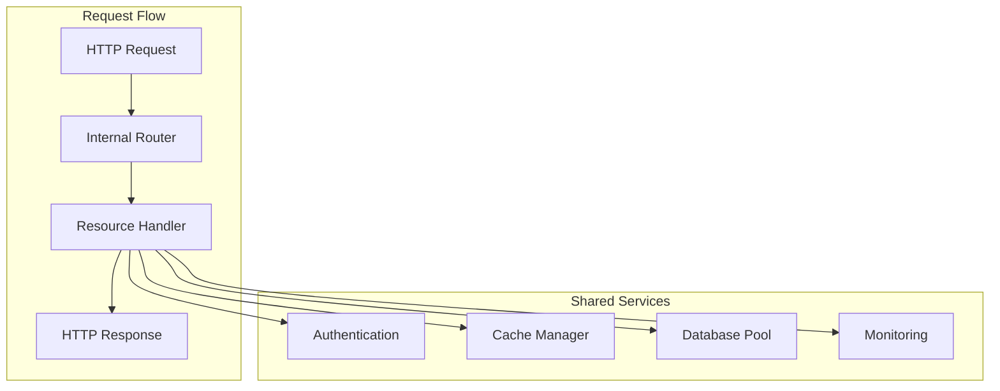

# Developer Training Guide

## Overview

This comprehensive training guide helps developers understand and work with the consolidated function architecture. It covers the new patterns, best practices, and hands-on exercises for effective development and maintenance.

## Learning Objectives

By completing this training, developers will be able to:

1. **Understand** the consolidated function architecture and its benefits
2. **Navigate** the new codebase structure and patterns
3. **Implement** new features using consolidated handlers
4. **Debug** and troubleshoot issues in the new architecture
5. **Optimize** performance using caching and database strategies
6. **Deploy** changes safely using the blue-green deployment process

## Module 1: Architecture Overview (30 minutes)

### 1.1 From Individual Functions to Consolidated Handlers

#### Before: Individual Function Architecture
```
/api/admin/exams/route.ts          (Individual function)
/api/admin/students/route.ts       (Individual function)
/api/admin/results/route.ts        (Individual function)
/api/admin/settings/route.ts       (Individual function)
... (60+ individual functions)
```

#### After: Consolidated Handler Architecture
```
/api/admin/route.ts                (Consolidated handler)
  ├── Internal routing for exams
  ├── Internal routing for students
  ├── Internal routing for results
  └── Internal routing for settings
```

#### Benefits of Consolidation

1. **Reduced Function Count**: From 63+ to 4 main handlers (93% reduction)
2. **Shared Resources**: Connection pooling, authentication, caching
3. **Faster Cold Starts**: Shared initialization and warming
4. **Better Monitoring**: Centralized metrics and logging
5. **Cost Optimization**: Reduced function invocations and compute costs

### 1.2 Consolidated Handler Structure



### 1.3 Key Architectural Patterns

#### Unified Handler Pattern
```typescript
// Pattern: Single entry point with internal routing
export async function POST(request: Request) {
  const { pathname } = new URL(request.url);
  const pathParts = pathname.split('/').filter(Boolean);
  
  // Extract resource and action from path
  const [, , resource, action] = pathParts; // ['api', 'admin', 'exams', 'create']
  
  // Route to appropriate handler
  const handler = getResourceHandler(resource);
  return handler.execute(action, request);
}
```

#### Middleware Chain Pattern
```typescript
// Pattern: Composable middleware for cross-cutting concerns
const middlewareChain = [
  authenticationMiddleware,
  validationMiddleware,
  rateLimitingMiddleware,
  auditLoggingMiddleware
];

const executeWithMiddleware = async (handler, request) => {
  let context = { request };
  
  // Execute middleware chain
  for (const middleware of middlewareChain) {
    context = await middleware(context);
  }
  
  // Execute main handler
  return handler(context);
};
```

## Module 2: Development Patterns (45 minutes)

### 2.1 Working with Consolidated Handlers

#### Creating a New Resource Handler

```typescript
// src/lib/handlers/new-resource-handler.ts
import { BaseHandler } from './base-handler';
import { z } from 'zod';

export class NewResourceHandler extends BaseHandler {
  constructor() {
    super('new-resource');
  }
  
  // Define validation schemas
  private schemas = {
    create: z.object({
      name: z.string().min(1).max(100),
      description: z.string().optional(),
      settings: z.object({}).optional()
    }),
    update: z.object({
      id: z.string().uuid(),
      name: z.string().min(1).max(100).optional(),
      description: z.string().optional()
    })
  };
  
  async create(request: Request) {
    // Validate input
    const data = await this.validateInput(request, this.schemas.create);
    
    // Business logic
    const result = await this.db.query(
      'INSERT INTO new_resources (name, description, settings) VALUES ($1, $2, $3) RETURNING *',
      [data.name, data.description, data.settings]
    );
    
    // Invalidate related caches
    await this.cache.invalidateTags(['new-resources']);
    
    // Audit logging
    await this.auditLog('new_resource_created', { id: result.rows[0].id });
    
    return this.successResponse(result.rows[0]);
  }
  
  async list(request: Request) {
    const { searchParams } = new URL(request.url);
    const page = parseInt(searchParams.get('page') || '1');
    const limit = Math.min(parseInt(searchParams.get('limit') || '50'), 100);
    
    // Try cache first
    const cacheKey = `new-resources:list:${page}:${limit}`;
    const cached = await this.cache.get(cacheKey);
    if (cached) {
      return this.successResponse(cached);
    }
    
    // Query database
    const result = await this.db.query(
      'SELECT * FROM new_resources ORDER BY created_at DESC LIMIT $1 OFFSET $2',
      [limit, (page - 1) * limit]
    );
    
    // Cache result
    await this.cache.set(cacheKey, result.rows, 300); // 5 minutes
    
    return this.successResponse(result.rows);
  }
  
  async update(request: Request) {
    const data = await this.validateInput(request, this.schemas.update);
    
    const result = await this.db.query(
      'UPDATE new_resources SET name = COALESCE($2, name), description = COALESCE($3, description), updated_at = NOW() WHERE id = $1 RETURNING *',
      [data.id, data.name, data.description]
    );
    
    if (result.rows.length === 0) {
      return this.errorResponse('Resource not found', 404);
    }
    
    // Invalidate caches
    await this.cache.invalidateTags(['new-resources', `new-resource:${data.id}`]);
    
    await this.auditLog('new_resource_updated', { id: data.id, changes: data });
    
    return this.successResponse(result.rows[0]);
  }
  
  async delete(request: Request) {
    const { id } = await this.validateInput(request, z.object({ id: z.string().uuid() }));
    
    const result = await this.db.query(
      'DELETE FROM new_resources WHERE id = $1 RETURNING id',
      [id]
    );
    
    if (result.rows.length === 0) {
      return this.errorResponse('Resource not found', 404);
    }
    
    await this.cache.invalidateTags(['new-resources', `new-resource:${id}`]);
    await this.auditLog('new_resource_deleted', { id });
    
    return this.successResponse({ deleted: true, id });
  }
}
```

#### Integrating with Main Handler

```typescript
// src/app/api/admin/route.ts
import { NewResourceHandler } from '@/lib/handlers/new-resource-handler';

const resourceHandlers = {
  exams: new ExamHandler(),
  students: new StudentHandler(),
  results: new ResultsHandler(),
  'new-resource': new NewResourceHandler(), // Add new handler
  // ... other handlers
};

export async function POST(request: Request) {
  const { pathname } = new URL(request.url);
  const [, , resource, action] = pathname.split('/').filter(Boolean);
  
  const handler = resourceHandlers[resource];
  if (!handler) {
    return new Response(JSON.stringify({ error: 'Resource not found' }), {
      status: 404,
      headers: { 'Content-Type': 'application/json' }
    });
  }
  
  return handler.execute(action, request);
}
```

### 2.2 Database Integration Patterns

#### Using the Query Optimizer

```typescript
// Optimized database queries
import { QueryOptimizer } from '@/lib/database/query-optimizer';

class ExamHandler extends BaseHandler {
  private queryOptimizer = new QueryOptimizer();
  
  async getExamWithAttempts(examId: string) {
    // Use optimized query with caching
    const query = this.queryOptimizer.optimize({
      name: 'exam_with_attempts',
      query: `
        SELECT 
          e.*,
          COUNT(ea.id) as attempt_count,
          AVG(ea.score) FILTER (WHERE ea.status = 'completed') as avg_score
        FROM exams e
        LEFT JOIN exam_attempts ea ON ea.exam_id = e.id
        WHERE e.id = $1
        GROUP BY e.id
      `,
      parameters: [examId],
      cacheKey: `exam:${examId}:with_attempts`,
      cacheTTL: 300
    });
    
    return this.queryOptimizer.execute(query);
  }
  
  async batchUpdateScores(updates: Array<{id: string, score: number}>) {
    // Use batch operations for efficiency
    return this.queryOptimizer.executeBatch({
      name: 'batch_update_scores',
      query: `
        UPDATE exam_attempts 
        SET score = data.score, updated_at = NOW()
        FROM (VALUES ${updates.map((_, i) => `($${i*2+1}, $${i*2+2})`).join(', ')}) 
        AS data(id, score)
        WHERE exam_attempts.id = data.id::uuid
      `,
      parameters: updates.flatMap(u => [u.id, u.score])
    });
  }
}
```

#### Working with Consolidated RPCs

```typescript
// Using consolidated RPC functions
import { ConsolidatedRPCClient } from '@/lib/database/consolidated-rpc-client';

class AttemptHandler extends BaseHandler {
  private rpcClient = new ConsolidatedRPCClient();
  
  async saveAttemptProgress(attemptId: string, answers: any) {
    return this.rpcClient.execute('consolidated_attempt_operations', {
      operation_type: 'save_progress',
      attempt_data: {
        attempt_id: attemptId,
        answers: answers
      }
    });
  }
  
  async submitAttempt(attemptId: string, finalAnswers: any) {
    return this.rpcClient.execute('consolidated_attempt_operations', {
      operation_type: 'submit_attempt',
      attempt_data: {
        attempt_id: attemptId,
        answers: finalAnswers
      }
    });
  }
}
```

### 2.3 Caching Strategies

#### Implementing Smart Caching

```typescript
// Smart caching with tags and TTL
class CacheAwareHandler extends BaseHandler {
  
  async getCachedData(key: string, fetcher: () => Promise<any>, options: {
    ttl?: number;
    tags?: string[];
    warmOnMiss?: boolean;
  } = {}) {
    // Try cache first
    const cached = await this.cache.get(key);
    if (cached) {
      return cached;
    }
    
    // Fetch fresh data
    const data = await fetcher();
    
    // Cache with tags for invalidation
    await this.cache.set(key, data, options.ttl || 300, options.tags || []);
    
    // Optionally warm related caches
    if (options.warmOnMiss) {
      this.warmRelatedCaches(key, data);
    }
    
    return data;
  }
  
  async warmRelatedCaches(key: string, data: any) {
    // Implement cache warming logic based on data relationships
    if (key.startsWith('exam:')) {
      const examId = key.split(':')[1];
      // Warm related exam caches
      await this.cache.set(`exam:${examId}:questions`, data.questions, 3600);
      await this.cache.set(`exam:${examId}:settings`, data.settings, 7200);
    }
  }
  
  async invalidateRelatedCaches(resource: string, id: string) {
    const invalidationMap = {
      exam: [`exam:${id}:*`, 'exam_list', 'active_exams'],
      student: [`student:${id}:*`, 'student_list'],
      attempt: [`attempt:${id}:*`, `exam:*:attempts`]
    };
    
    const patterns = invalidationMap[resource] || [];
    for (const pattern of patterns) {
      await this.cache.invalidatePattern(pattern);
    }
  }
}
```

## Module 3: Hands-On Exercises (60 minutes)

### Exercise 1: Create a New Feature Handler (20 minutes)

**Objective**: Implement a "Announcements" feature in the admin panel

**Requirements**:
1. CRUD operations for announcements
2. Caching for list and individual announcements
3. Audit logging for all operations
4. Input validation using Zod

**Starter Code**:
```typescript
// src/lib/handlers/announcements-handler.ts
import { BaseHandler } from './base-handler';
import { z } from 'zod';

export class AnnouncementsHandler extends BaseHandler {
  constructor() {
    super('announcements');
  }
  
  // TODO: Implement the following methods:
  // - create(request: Request)
  // - list(request: Request) 
  // - update(request: Request)
  // - delete(request: Request)
  // - publish(request: Request) // Set status to 'published'
}
```

**Solution**:
```typescript
export class AnnouncementsHandler extends BaseHandler {
  constructor() {
    super('announcements');
  }
  
  private schemas = {
    create: z.object({
      title: z.string().min(1).max(200),
      content: z.string().min(1),
      priority: z.enum(['low', 'medium', 'high']).default('medium'),
      target_audience: z.enum(['all', 'students', 'admins']).default('all')
    }),
    update: z.object({
      id: z.string().uuid(),
      title: z.string().min(1).max(200).optional(),
      content: z.string().min(1).optional(),
      priority: z.enum(['low', 'medium', 'high']).optional()
    })
  };
  
  async create(request: Request) {
    const data = await this.validateInput(request, this.schemas.create);
    
    const result = await this.db.query(`
      INSERT INTO announcements (title, content, priority, target_audience, status, created_by)
      VALUES ($1, $2, $3, $4, 'draft', $5)
      RETURNING *
    `, [data.title, data.content, data.priority, data.target_audience, this.context.user.id]);
    
    await this.cache.invalidateTags(['announcements']);
    await this.auditLog('announcement_created', { id: result.rows[0].id });
    
    return this.successResponse(result.rows[0]);
  }
  
  async list(request: Request) {
    const { searchParams } = new URL(request.url);
    const status = searchParams.get('status') || 'all';
    const page = parseInt(searchParams.get('page') || '1');
    const limit = Math.min(parseInt(searchParams.get('limit') || '20'), 100);
    
    const cacheKey = `announcements:list:${status}:${page}:${limit}`;
    
    return this.getCachedData(cacheKey, async () => {
      const whereClause = status !== 'all' ? 'WHERE status = $3' : '';
      const params = [limit, (page - 1) * limit];
      if (status !== 'all') params.push(status);
      
      const result = await this.db.query(`
        SELECT a.*, u.name as created_by_name
        FROM announcements a
        JOIN admin_users u ON u.id = a.created_by
        ${whereClause}
        ORDER BY a.created_at DESC
        LIMIT $1 OFFSET $2
      `, params);
      
      return result.rows;
    }, { ttl: 300, tags: ['announcements'] });
  }
  
  async update(request: Request) {
    const data = await this.validateInput(request, this.schemas.update);
    
    const result = await this.db.query(`
      UPDATE announcements 
      SET title = COALESCE($2, title),
          content = COALESCE($3, content),
          priority = COALESCE($4, priority),
          updated_at = NOW()
      WHERE id = $1
      RETURNING *
    `, [data.id, data.title, data.content, data.priority]);
    
    if (result.rows.length === 0) {
      return this.errorResponse('Announcement not found', 404);
    }
    
    await this.cache.invalidateTags(['announcements', `announcement:${data.id}`]);
    await this.auditLog('announcement_updated', { id: data.id, changes: data });
    
    return this.successResponse(result.rows[0]);
  }
  
  async delete(request: Request) {
    const { id } = await this.validateInput(request, z.object({ id: z.string().uuid() }));
    
    const result = await this.db.query('DELETE FROM announcements WHERE id = $1 RETURNING id', [id]);
    
    if (result.rows.length === 0) {
      return this.errorResponse('Announcement not found', 404);
    }
    
    await this.cache.invalidateTags(['announcements', `announcement:${id}`]);
    await this.auditLog('announcement_deleted', { id });
    
    return this.successResponse({ deleted: true, id });
  }
  
  async publish(request: Request) {
    const { id } = await this.validateInput(request, z.object({ id: z.string().uuid() }));
    
    const result = await this.db.query(`
      UPDATE announcements 
      SET status = 'published', published_at = NOW()
      WHERE id = $1 AND status = 'draft'
      RETURNING *
    `, [id]);
    
    if (result.rows.length === 0) {
      return this.errorResponse('Announcement not found or already published', 404);
    }
    
    await this.cache.invalidateTags(['announcements', `announcement:${id}`, 'published_announcements']);
    await this.auditLog('announcement_published', { id });
    
    return this.successResponse(result.rows[0]);
  }
}
```

### Exercise 2: Optimize a Slow Query (15 minutes)

**Scenario**: The exam results endpoint is slow when loading large result sets.

**Current Implementation**:
```typescript
async getExamResults(examId: string) {
  const result = await this.db.query(`
    SELECT s.name, s.code, ea.score, ea.completed_at, ea.time_taken
    FROM exam_attempts ea
    JOIN students s ON s.id = ea.student_id
    WHERE ea.exam_id = $1 AND ea.status = 'completed'
    ORDER BY ea.score DESC
  `, [examId]);
  
  return result.rows;
}
```

**Task**: Optimize this query using:
1. Proper indexing
2. Pagination
3. Caching
4. Query optimization

**Solution**:
```typescript
// 1. Add database index (run this migration)
// CREATE INDEX CONCURRENTLY idx_exam_attempts_results 
// ON exam_attempts(exam_id, status, score DESC) 
// WHERE status = 'completed';

async getExamResults(examId: string, options: {
  page?: number;
  limit?: number;
  sortBy?: 'score' | 'name' | 'completed_at';
  sortOrder?: 'asc' | 'desc';
} = {}) {
  const page = options.page || 1;
  const limit = Math.min(options.limit || 50, 100);
  const sortBy = options.sortBy || 'score';
  const sortOrder = options.sortOrder || 'desc';
  
  const cacheKey = `exam:${examId}:results:${page}:${limit}:${sortBy}:${sortOrder}`;
  
  return this.getCachedData(cacheKey, async () => {
    // Optimized query with proper ordering and pagination
    const orderClause = sortBy === 'name' ? 's.name' : 
                       sortBy === 'completed_at' ? 'ea.completed_at' : 'ea.score';
    
    const result = await this.db.query(`
      SELECT 
        s.name, 
        s.code, 
        ea.score, 
        ea.completed_at, 
        ea.time_taken,
        COUNT(*) OVER() as total_count
      FROM exam_attempts ea
      JOIN students s ON s.id = ea.student_id
      WHERE ea.exam_id = $1 AND ea.status = 'completed'
      ORDER BY ${orderClause} ${sortOrder.toUpperCase()}
      LIMIT $2 OFFSET $3
    `, [examId, limit, (page - 1) * limit]);
    
    return {
      results: result.rows,
      pagination: {
        page,
        limit,
        total: result.rows[0]?.total_count || 0,
        pages: Math.ceil((result.rows[0]?.total_count || 0) / limit)
      }
    };
  }, { 
    ttl: 600, // 10 minutes
    tags: [`exam:${examId}:results`] 
  });
}
```

### Exercise 3: Implement Error Handling and Recovery (25 minutes)

**Scenario**: Implement robust error handling for the attempt submission process.

**Requirements**:
1. Handle database connection failures
2. Implement retry logic for transient errors
3. Provide graceful degradation
4. Log errors appropriately

**Starter Code**:
```typescript
async submitAttempt(attemptId: string, answers: any) {
  // TODO: Add error handling and retry logic
  const result = await this.db.query(`
    UPDATE exam_attempts 
    SET status = 'completed', final_answers = $2, completed_at = NOW()
    WHERE id = $1
    RETURNING *
  `, [attemptId, answers]);
  
  return result.rows[0];
}
```

**Solution**:
```typescript
import { CircuitBreaker } from '@/lib/utils/circuit-breaker';

class AttemptHandler extends BaseHandler {
  private circuitBreaker = new CircuitBreaker({
    failureThreshold: 5,
    recoveryTimeout: 30000
  });
  
  async submitAttempt(attemptId: string, answers: any) {
    const maxRetries = 3;
    let lastError: Error;
    
    for (let attempt = 1; attempt <= maxRetries; attempt++) {
      try {
        return await this.circuitBreaker.execute(async () => {
          return this.performSubmission(attemptId, answers);
        });
      } catch (error) {
        lastError = error as Error;
        
        // Log the error
        console.error(`Attempt submission failed (attempt ${attempt}/${maxRetries}):`, {
          attemptId,
          error: error.message,
          stack: error.stack
        });
        
        // Check if error is retryable
        if (!this.isRetryableError(error)) {
          break;
        }
        
        // Wait before retry (exponential backoff)
        if (attempt < maxRetries) {
          const delay = Math.pow(2, attempt - 1) * 1000; // 1s, 2s, 4s
          await this.sleep(delay);
        }
      }
    }
    
    // All retries failed, try graceful degradation
    return this.handleSubmissionFailure(attemptId, answers, lastError);
  }
  
  private async performSubmission(attemptId: string, answers: any) {
    // Start database transaction
    const client = await this.db.connect();
    
    try {
      await client.query('BEGIN');
      
      // Update attempt status
      const result = await client.query(`
        UPDATE exam_attempts 
        SET status = 'completed', 
            final_answers = $2, 
            completed_at = NOW(),
            score = calculate_score(id, $2)
        WHERE id = $1 AND status = 'in_progress'
        RETURNING *
      `, [attemptId, answers]);
      
      if (result.rows.length === 0) {
        throw new Error('Attempt not found or already submitted');
      }
      
      const attempt = result.rows[0];
      
      // Log submission in audit table
      await client.query(`
        INSERT INTO audit_logs (action, resource_type, resource_id, user_id, details)
        VALUES ('attempt_submitted', 'exam_attempt', $1, $2, $3)
      `, [attemptId, attempt.student_id, { score: attempt.score }]);
      
      await client.query('COMMIT');
      
      // Invalidate related caches
      await this.cache.invalidateTags([
        `attempt:${attemptId}`,
        `exam:${attempt.exam_id}:attempts`,
        `student:${attempt.student_id}:attempts`
      ]);
      
      return attempt;
      
    } catch (error) {
      await client.query('ROLLBACK');
      throw error;
    } finally {
      client.release();
    }
  }
  
  private isRetryableError(error: any): boolean {
    // Define which errors are worth retrying
    const retryableErrors = [
      'ECONNRESET',
      'ETIMEDOUT',
      'ENOTFOUND',
      'connection terminated',
      'server closed the connection',
      'Connection terminated'
    ];
    
    return retryableErrors.some(retryableError => 
      error.message?.includes(retryableError) || 
      error.code === retryableError
    );
  }
  
  private async handleSubmissionFailure(attemptId: string, answers: any, error: Error) {
    // Graceful degradation: save to temporary storage
    try {
      await this.cache.set(
        `failed_submission:${attemptId}`, 
        { answers, timestamp: Date.now(), error: error.message },
        3600 // 1 hour TTL
      );
      
      // Queue for retry processing
      await this.queueForRetry(attemptId, answers);
      
      // Return partial success response
      return {
        id: attemptId,
        status: 'submission_queued',
        message: 'Submission is being processed. You will be notified when complete.',
        queued_at: new Date().toISOString()
      };
      
    } catch (fallbackError) {
      // Last resort: log and throw
      console.error('Complete submission failure:', {
        attemptId,
        originalError: error.message,
        fallbackError: fallbackError.message
      });
      
      throw new Error('Submission failed. Please try again or contact support.');
    }
  }
  
  private async queueForRetry(attemptId: string, answers: any) {
    // Add to retry queue (could be Redis, database, or message queue)
    await this.cache.lpush('submission_retry_queue', JSON.stringify({
      attemptId,
      answers,
      timestamp: Date.now(),
      retryCount: 0
    }));
  }
  
  private sleep(ms: number): Promise<void> {
    return new Promise(resolve => setTimeout(resolve, ms));
  }
}
```

## Module 4: Testing and Debugging (30 minutes)

### 4.1 Testing Consolidated Handlers

#### Unit Testing Pattern

```typescript
// tests/handlers/announcements-handler.test.ts
import { AnnouncementsHandler } from '@/lib/handlers/announcements-handler';
import { createMockContext } from '../utils/mock-context';

describe('AnnouncementsHandler', () => {
  let handler: AnnouncementsHandler;
  let mockContext: any;
  
  beforeEach(() => {
    mockContext = createMockContext();
    handler = new AnnouncementsHandler();
    handler.setContext(mockContext);
  });
  
  describe('create', () => {
    it('should create announcement with valid data', async () => {
      const requestData = {
        title: 'Test Announcement',
        content: 'This is a test announcement',
        priority: 'high',
        target_audience: 'all'
      };
      
      mockContext.db.query.mockResolvedValue({
        rows: [{ id: 'test-id', ...requestData, status: 'draft' }]
      });
      
      const request = new Request('http://localhost/api/admin/announcements/create', {
        method: 'POST',
        body: JSON.stringify(requestData),
        headers: { 'Content-Type': 'application/json' }
      });
      
      const response = await handler.create(request);
      const result = await response.json();
      
      expect(response.status).toBe(200);
      expect(result.success).toBe(true);
      expect(result.data.title).toBe(requestData.title);
      expect(mockContext.cache.invalidateTags).toHaveBeenCalledWith(['announcements']);
    });
    
    it('should return validation error for invalid data', async () => {
      const request = new Request('http://localhost/api/admin/announcements/create', {
        method: 'POST',
        body: JSON.stringify({ title: '' }), // Invalid: empty title
        headers: { 'Content-Type': 'application/json' }
      });
      
      const response = await handler.create(request);
      const result = await response.json();
      
      expect(response.status).toBe(400);
      expect(result.success).toBe(false);
      expect(result.error.code).toBe('VALIDATION_ERROR');
    });
  });
});
```

#### Integration Testing

```typescript
// tests/integration/admin-api.test.ts
import { testClient } from '../utils/test-client';

describe('Admin API Integration', () => {
  let authToken: string;
  
  beforeAll(async () => {
    // Set up test database and get auth token
    authToken = await testClient.getAdminToken();
  });
  
  describe('Announcements API', () => {
    it('should handle complete CRUD workflow', async () => {
      // Create announcement
      const createResponse = await testClient.post('/api/admin/announcements/create', {
        title: 'Integration Test Announcement',
        content: 'This is a test',
        priority: 'medium'
      }, { Authorization: `Bearer ${authToken}` });
      
      expect(createResponse.status).toBe(200);
      const created = await createResponse.json();
      const announcementId = created.data.id;
      
      // List announcements
      const listResponse = await testClient.get('/api/admin/announcements/list');
      expect(listResponse.status).toBe(200);
      const list = await listResponse.json();
      expect(list.data.some(a => a.id === announcementId)).toBe(true);
      
      // Update announcement
      const updateResponse = await testClient.put('/api/admin/announcements/update', {
        id: announcementId,
        title: 'Updated Title'
      }, { Authorization: `Bearer ${authToken}` });
      
      expect(updateResponse.status).toBe(200);
      
      // Delete announcement
      const deleteResponse = await testClient.delete('/api/admin/announcements/delete', {
        id: announcementId
      }, { Authorization: `Bearer ${authToken}` });
      
      expect(deleteResponse.status).toBe(200);
    });
  });
});
```

### 4.2 Debugging Techniques

#### Logging and Monitoring

```typescript
// Enhanced logging for debugging
class DebuggableHandler extends BaseHandler {
  
  async execute(action: string, request: Request) {
    const requestId = this.generateRequestId();
    const startTime = Date.now();
    
    // Log request start
    console.log(`[${requestId}] Request started:`, {
      action,
      url: request.url,
      method: request.method,
      userAgent: request.headers.get('user-agent'),
      timestamp: new Date().toISOString()
    });
    
    try {
      const result = await super.execute(action, request);
      
      // Log successful completion
      const duration = Date.now() - startTime;
      console.log(`[${requestId}] Request completed:`, {
        action,
        duration,
        status: result.status,
        timestamp: new Date().toISOString()
      });
      
      return result;
      
    } catch (error) {
      // Log error details
      const duration = Date.now() - startTime;
      console.error(`[${requestId}] Request failed:`, {
        action,
        duration,
        error: error.message,
        stack: error.stack,
        timestamp: new Date().toISOString()
      });
      
      throw error;
    }
  }
  
  private generateRequestId(): string {
    return `req_${Date.now()}_${Math.random().toString(36).substr(2, 9)}`;
  }
}
```

#### Performance Profiling

```typescript
// Performance profiling utilities
class PerformanceProfiler {
  private metrics: Map<string, number[]> = new Map();
  
  async profile<T>(name: string, operation: () => Promise<T>): Promise<T> {
    const startTime = process.hrtime.bigint();
    const startMemory = process.memoryUsage().heapUsed;
    
    try {
      const result = await operation();
      
      const endTime = process.hrtime.bigint();
      const endMemory = process.memoryUsage().heapUsed;
      
      const duration = Number(endTime - startTime) / 1000000; // Convert to milliseconds
      const memoryDelta = endMemory - startMemory;
      
      // Store metrics
      if (!this.metrics.has(name)) {
        this.metrics.set(name, []);
      }
      this.metrics.get(name)!.push(duration);
      
      console.log(`Performance [${name}]:`, {
        duration: `${duration.toFixed(2)}ms`,
        memoryDelta: `${(memoryDelta / 1024 / 1024).toFixed(2)}MB`,
        timestamp: new Date().toISOString()
      });
      
      return result;
      
    } catch (error) {
      console.error(`Performance [${name}] - Error:`, error.message);
      throw error;
    }
  }
  
  getStats(name: string) {
    const measurements = this.metrics.get(name) || [];
    if (measurements.length === 0) return null;
    
    const sorted = [...measurements].sort((a, b) => a - b);
    return {
      count: measurements.length,
      min: sorted[0],
      max: sorted[sorted.length - 1],
      avg: measurements.reduce((a, b) => a + b, 0) / measurements.length,
      p50: sorted[Math.floor(sorted.length * 0.5)],
      p95: sorted[Math.floor(sorted.length * 0.95)],
      p99: sorted[Math.floor(sorted.length * 0.99)]
    };
  }
}

// Usage in handlers
const profiler = new PerformanceProfiler();

async getExamResults(examId: string) {
  return profiler.profile('get_exam_results', async () => {
    return profiler.profile('database_query', async () => {
      return this.db.query('SELECT * FROM exam_results WHERE exam_id = $1', [examId]);
    });
  });
}
```

## Module 5: Best Practices and Guidelines (15 minutes)

### 5.1 Code Organization

#### File Structure
```
src/
├── lib/
│   ├── handlers/
│   │   ├── base-handler.ts          # Base class for all handlers
│   │   ├── exam-handler.ts          # Exam-specific operations
│   │   ├── student-handler.ts       # Student-specific operations
│   │   └── announcements-handler.ts # New feature handlers
│   ├── middleware/
│   │   ├── auth.ts                  # Authentication middleware
│   │   ├── validation.ts            # Input validation
│   │   └── rate-limiting.ts         # Rate limiting
│   ├── database/
│   │   ├── query-optimizer.ts       # Query optimization
│   │   ├── connection-pool.ts       # Connection management
│   │   └── migrations/              # Database migrations
│   └── cache/
│       ├── cache-manager.ts         # Cache abstraction
│       ├── strategies.ts            # Caching strategies
│       └── invalidation.ts          # Cache invalidation
```

#### Naming Conventions

```typescript
// Handler classes: PascalCase with "Handler" suffix
class ExamHandler extends BaseHandler { }
class StudentHandler extends BaseHandler { }

// Methods: camelCase, descriptive action names
async createExam(request: Request) { }
async updateExamSettings(request: Request) { }
async publishExam(request: Request) { }

// Constants: UPPER_SNAKE_CASE
const MAX_RETRY_ATTEMPTS = 3;
const DEFAULT_CACHE_TTL = 300;

// Cache keys: lowercase with colons as separators
const cacheKey = `exam:${examId}:results:${page}`;
const listKey = 'active_exams:list';
```

### 5.2 Error Handling Standards

```typescript
// Standard error response format
interface ErrorResponse {
  success: false;
  error: {
    code: string;
    message: string;
    details?: any;
    timestamp: string;
    request_id?: string;
  };
}

// Error codes enum
enum ErrorCodes {
  VALIDATION_ERROR = 'VALIDATION_ERROR',
  NOT_FOUND = 'NOT_FOUND',
  UNAUTHORIZED = 'UNAUTHORIZED',
  FORBIDDEN = 'FORBIDDEN',
  RATE_LIMITED = 'RATE_LIMITED',
  INTERNAL_ERROR = 'INTERNAL_ERROR',
  DATABASE_ERROR = 'DATABASE_ERROR',
  CACHE_ERROR = 'CACHE_ERROR'
}

// Error handling in handlers
class BaseHandler {
  protected errorResponse(message: string, status: number = 500, code?: string, details?: any) {
    return new Response(JSON.stringify({
      success: false,
      error: {
        code: code || this.getErrorCodeFromStatus(status),
        message,
        details,
        timestamp: new Date().toISOString(),
        request_id: this.context?.requestId
      }
    }), {
      status,
      headers: { 'Content-Type': 'application/json' }
    });
  }
  
  private getErrorCodeFromStatus(status: number): string {
    const statusMap = {
      400: ErrorCodes.VALIDATION_ERROR,
      401: ErrorCodes.UNAUTHORIZED,
      403: ErrorCodes.FORBIDDEN,
      404: ErrorCodes.NOT_FOUND,
      429: ErrorCodes.RATE_LIMITED,
      500: ErrorCodes.INTERNAL_ERROR
    };
    
    return statusMap[status] || ErrorCodes.INTERNAL_ERROR;
  }
}
```

### 5.3 Performance Guidelines

#### Database Best Practices

```typescript
// DO: Use prepared statements and parameterized queries
const result = await db.query(
  'SELECT * FROM exams WHERE id = $1 AND status = $2',
  [examId, 'active']
);

// DON'T: String concatenation (SQL injection risk)
const result = await db.query(
  `SELECT * FROM exams WHERE id = '${examId}' AND status = 'active'`
);

// DO: Use batch operations for multiple inserts
const values = students.map((_, i) => `($${i*3+1}, $${i*3+2}, $${i*3+3})`).join(', ');
const params = students.flatMap(s => [s.name, s.code, s.email]);
await db.query(`INSERT INTO students (name, code, email) VALUES ${values}`, params);

// DON'T: Multiple individual inserts
for (const student of students) {
  await db.query('INSERT INTO students (name, code, email) VALUES ($1, $2, $3)', 
    [student.name, student.code, student.email]);
}
```

#### Caching Best Practices

```typescript
// DO: Use appropriate TTL based on data volatility
const cacheStrategies = {
  static_data: 86400,      // 24 hours (system settings, etc.)
  semi_static: 3600,       // 1 hour (exam info, user profiles)
  dynamic: 300,            // 5 minutes (exam results, statistics)
  real_time: 60            // 1 minute (active attempts, live data)
};

// DO: Use cache tags for efficient invalidation
await cache.set(key, data, ttl, [`exam:${examId}`, 'exam_list']);

// DO: Implement cache warming for critical data
await this.warmCriticalCaches(['active_exams', 'system_settings']);

// DON'T: Cache user-specific data without proper isolation
// Bad: await cache.set('user_data', userData); 
// Good: await cache.set(`user:${userId}:data`, userData);
```

## Assessment and Certification

### Knowledge Check Questions

1. **Architecture Understanding**
   - Explain the benefits of function consolidation over individual functions
   - Describe the internal routing mechanism in consolidated handlers
   - What are the four main consolidated handlers and their responsibilities?

2. **Implementation Skills**
   - How would you add a new resource handler to the admin API?
   - What caching strategy would you use for frequently updated data?
   - How do you implement proper error handling with retry logic?

3. **Performance Optimization**
   - What database optimization techniques are used in the new architecture?
   - How does the multi-tier caching system improve performance?
   - What monitoring metrics are most important to track?

### Practical Assessment

**Task**: Implement a "Notifications" system with the following requirements:

1. **CRUD Operations**: Create, read, update, delete notifications
2. **Real-time Delivery**: Send notifications to users in real-time
3. **Caching Strategy**: Implement appropriate caching for user notifications
4. **Performance**: Handle 1000+ concurrent users efficiently
5. **Testing**: Write comprehensive unit and integration tests

**Evaluation Criteria**:
- Code quality and adherence to patterns
- Proper error handling and validation
- Effective caching implementation
- Performance optimization techniques
- Test coverage and quality

### Certification Levels

**Level 1 - Basic Proficiency**
- Understands consolidated architecture
- Can implement simple CRUD handlers
- Follows basic coding standards

**Level 2 - Intermediate Proficiency**
- Implements complex business logic
- Optimizes database queries and caching
- Handles errors gracefully with retry logic

**Level 3 - Advanced Proficiency**
- Designs new architectural patterns
- Optimizes system performance
- Mentors other developers

This training guide provides comprehensive knowledge and hands-on experience with the consolidated function architecture, ensuring developers can effectively work with and extend the optimized system.